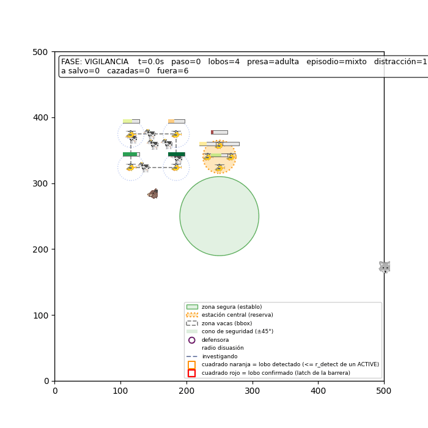

# Crossing the Coordination Valley 🐺🚁

**Hierarchical RL managers learn two-front tactics — on both sides of a
drone-based livestock-protection game.**

> A decoy wolf draws the drone barrier away while the pack strikes the
> opposite flank. Nobody programmed that tactic: a hierarchical RL "coach"
> learned it from pure reward — after eight flat-RL campaigns failed. Then
> the defending side learned to split its forces and stopped it.

📄 **Paper**: [English (PDF)](results/paper/OrdasCernadas_HRL_two_front_coordination_EN.pdf) · [Español (PDF)](results/paper/OrdasCernadas_HRL_coordinacion_dos_frentes_ES.pdf)

*Course project — Laboratorio de IA, B.Sc. in Mathematical Engineering and
Artificial Intelligence, Universidad Pontificia Comillas (Madrid). Code and
internal docs are in Spanish.*

---

## Why wolves and cows?

An effective **non-lethal** drone defense has a double benefit: ranchers stop
losing livestock, and once the damage disappears, so does the main motive for
retaliatory wolf killings. Fewer dead cattle *and* fewer dead wolves —
technology in service of coexistence.

## The problem: a reward valley

The attacker's key tactic — the **two-front bait** — requires splitting the
pack, which *worsens* the return for thousands of simulation steps before the
deception pays off. Step-by-step optimizers reach the valley's edge, see
things getting worse, and turn back (*relative overgeneralization*, in its
temporal variant). We measured it directly: the bait's cumulative kills run
below the greedy attack's until tick ≈2,100 and only cross in the episode's
tail.

**Flat RL does not cross this valley on either side:**
- 8 attacking campaigns (sparse PPO, reward shaping, behavior-cloning warm
  starts, residual learning, curricula) never produce the bait — and the
  residual ones, *initialized at the scripted tactic*, reproducibly
  **erode** it.
- 20M steps of MAPPO on the defending side never produce front-splitting.

## The solution: a hierarchical manager

One PPO "coach" per side chooses among **frozen scripted options** (attack
plays / defensive deployments), formulated as an **event-terminated semi-MDP**
with a small **deliberation cost** per voluntary interruption. Trying the
coordinated maneuver now costs one discrete choice instead of a
thousand-step choreography: the hierarchy doesn't wade the valley — it
bridges it.

## Key results

| | |
|---|---|
| **Convergence invariant** | 3/3 independent trainings converge to the same policy in the hard stratum: P(Δ90 \| dispersed) = 1.000, matching the measured best arm |
| **Attacker** | 1.76 kills/ep vs. 1.66 of the hand-distilled expert oracle (+0.10 [+0.03, +0.19]); non-inferiority reproduced in replication; transfers unchanged to two never-seen learned defenses |
| **Defender** | Learns conditional splitting (P(guards \| 2nd cluster) = 1.000 / 0.943 across two runs) and cuts the classical barrier's losses by 3–4× in all three conditions; discovers an unanticipated 2-2 split preference absent from every hand-written rule |
| **Ablation** | Fixed-clock termination still learns the structure but with a worse margin and ≈3.25× the compute: event termination is an ingredient of the *margin*, not the *mechanism* |
| **Specification gaming** | Three exploit episodes caught and closed by pre-registration + human behavioral auditing (witness seed 21: 7 kills with the exploit → 6 with the windmill → 0 under clean play) |

## Methodology as part of the result

Every training run was gated by a **frozen pre-registration** (baseline
thresholds + a composite success criterion: learned *structure* +
non-inferiority, δ=0.15), evaluated with **paired seeds** and bootstrap CIs,
and signed off in strict order: automated assertions → **human viewing** of
rendered episodes → numerical analysis. This protocol caught five environment
defects and three specification-gaming episodes before they could contaminate
conclusions — including a silent slot rotation present since v3.0 that
scripted-behavior guarantees had been unknowingly resting on.

The simulator is **bitwise deterministic**: every figure in the paper is
reproducible from its seed. Worlds are tagged (v3.4–v3.7); artifacts
(time-stamped pre-registrations, evaluations, event timelines, rendered
episodes, checkpoints) are archived with a manifest and SHA-256 hashes.

## Repository layout

[PENDIENTE — el encargo del README llegó truncado en este punto: falta el contenido de esta sección y la tarea 2 (bloques [PENDIENTE]). Reenviar el resto.]
